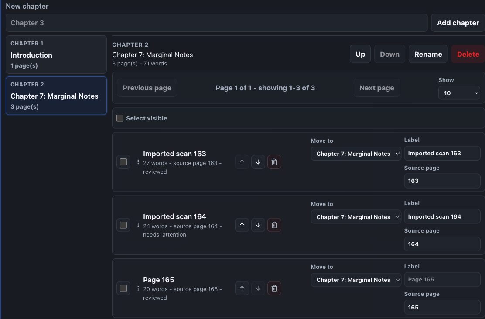
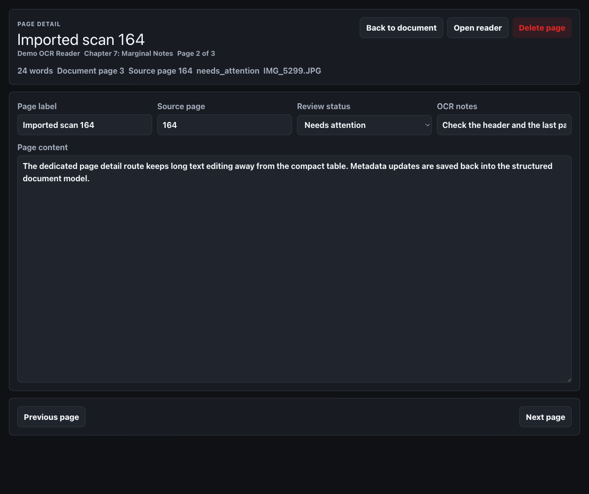
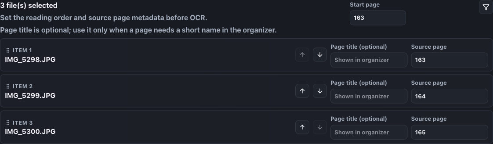

# Readrail

Readrail is a local-first Tauri desktop app for practicing evidence-aware speed reading. It supports pasted text and local text files without network calls, optional Gemini OCR with a user-owned API key, structured chapter/page organization, comprehension-adjusted session tracking, and exportable reading history.

## Current App

- Tauri 2, React 19, TypeScript, Vite, Tailwind CSS 4
- Local document library with paste and `.txt` / `.md` import
- Structured documents with chapters, ordered pages, source page numbers, review status, OCR notes, and editable page text
- Rail, chunk, and optional RSVP drill reader modes
- Session summary with comprehension score, adjusted WPM, self-rating, and notes
- Stats dashboard with WPM, adjusted WPM, minutes, words, and streak summaries
- CSV and JSON progress export
- SQLite schema initialization through `@tauri-apps/plugin-sql`
- Gemini API key commands backed by the OS keychain
- Optional Gemini OCR review flow using the user's API key

## v1.0.1 Highlights

- OCR imports default to filename A-Z ordering with numeric-aware sort, which keeps camera rolls like `IMG_00001`, `IMG_00002`, and `IMG_00003` in reading order.
- OCR staging includes quick sort controls, drag-and-drop ordering, compact rows, and a starting source page field that auto-fills page numbers from the current order.
- Document-level OCR imports target the currently selected chapter directly instead of requiring a destination dropdown.
- Library documents have a compact chapter/page organizer with page count controls for 10, 25, 50, or 100 visible rows.
- Each page has a dedicated detail route for editing page label, source page, review status, OCR notes, and full page content.
- The app UI is denser across panels, forms, organizer tables, document rows, and OCR review surfaces.

## Screenshots

### Compact Document Organizer



### Dedicated Page Detail Editor



### OCR Staging And Page Numbering



## Development

```bash
pnpm install
pnpm dev
```

Run the desktop shell:

```bash
pnpm tauri dev
```

Run checks:

```bash
pnpm lint
pnpm test
pnpm build
```

Build a local desktop artifact:

```bash
pnpm build:desktop
```

The macOS build output is written under `src-tauri/target/release/bundle/`. Install the generated `.dmg`/`.app` from there for local releases.

## Local Releases and Updates

Readrail is released locally. There is no GitHub CI/CD requirement for builds.

1. Update the versions in `package.json`, `src-tauri/tauri.conf.json`, and `src-tauri/Cargo.toml`.
2. Run `pnpm install` if dependencies changed.
3. Run `pnpm lint`, `pnpm test`, and `pnpm build:desktop`.
4. Tag the release locally, for example `git tag v1.0.1`.
5. Install the macOS app by opening the generated `.dmg`, dragging `Readrail.app` into `Applications`, and replacing the existing app when prompted.

User data is designed to survive app updates. Keep these values stable across releases:

- Tauri identifier: `com.jippylong12.readrail`
- SQLite database name: `readrail.db`
- Zustand fallback storage key: `readrail-local-state`

The desktop app writes durable records to SQLite using additive migrations, and on startup it can recover the UI state from SQLite if the WebView fallback storage is empty. Updating by installing a newer Readrail app over the old one should not delete the database. Uninstalling with an app cleaner, manually deleting app support data, or changing the identifier/database filename can still remove or orphan user data.

## Privacy Model

Readrail has no hosted backend and no telemetry. Documents and session data are stored locally. The Gemini key is entered in Settings and stored through Rust-side keychain commands under service `readrail` and account `gemini_api_key`. OCR requires explicit user action and sends selected files directly to Google's Gemini API using the user's key.

## Reading Science Positioning

Readrail optimizes for comprehension-adjusted speed rather than raw WPM. The default reader mode keeps normal context visible through guided line or phrase highlighting. RSVP is available as a focused drill and is not the primary training mode.

Research references for product copy and future docs:

- Schotter, Tran, and Rayner, "Don't Believe What You Read (Only Once): Comprehension Is Supported by Regressions During Reading", Psychological Science, 2014.
- RSVP and speed-reading comprehension tradeoffs: https://journals.plos.org/plosone/article?id=10.1371/journal.pone.0153786
- Gemini model docs: https://ai.google.dev/gemini-api/docs/models
